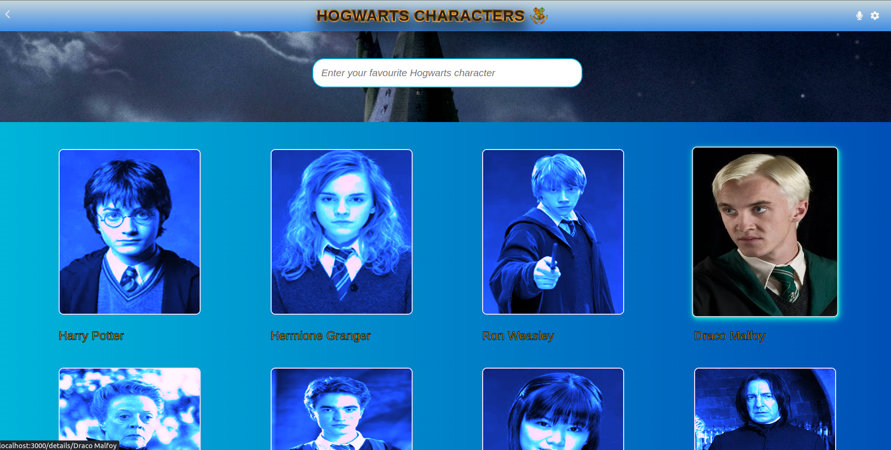

# House Of Wizards 🧙

<div align="center">

  
  <br/>

</div>


## Description
**A mobile web application that allows the user to create a list of metrics by utilizing React and Redux. I have chosen the Harry Potter API.**
**The webapp consists of two pages: the first page will display a list of items that can be filtered using the name, serving as the homepage. The second page will be for displaying the details of a particular item.** 
# 🛠 Built With
### Tech Stack:
- React

### Client:
- React

# 🚀 Live Demo <a name="live-demo"></a>

[House Of Wizards 🧙](https://house-of-wizards.onrender.com/)

[Loon video](https://www.loom.com/share/f8b7b9a8ff32439e86cfeb4230aca669)



### Server:
- local.
### Database:
- N/A.

# Key Features:
- React

# 💻 Getting Started:
### To get a local copy up and running, follow these steps:
- Installed Git.
- Create a local directory that you want to clone the repository.
- Open the command prompt in the created directory.
- On the terminal run this command git clone https://github.com/Salwa99/house-of-wizards.git
- Install the dev dependencies for linters run npm install.

# Prerequisites:
### In order to run this project you need:
- Installed Git.
- A browser.

# Setup:
- Clone this repository to your desired folder.

# Install:
### Install this project with:
- Git.
- Github.

# Usage:
### To run the project, execute the following command:
  ```sh 
  git clone https://github.com/Salwa99/house-of-wizards.git
  ```
  ```sh 
  cd Spacehub
  ```
  ```sh 
  npm install
  ```
  ```sh 
  npm start
  ```


# Run tests:

  ```sh 
  npm install react-test-renderer --save-dev
  ```
  ```sh 
  npm install --save-dev @testing-library/react
  ```
  ```sh 
  npm run test
  ```
### To run tests, run the following command:
  ```sh 
  npx eslint .
  ```
   ```sh 
  npx stylelint "**/*.{css,scss}
  ```


# Deployment:
### You can deploy this project using:
- Render

# 👥 Authors:
### 👤 Salwa Ballouti:
- GitHub: [@Salwa99](https://github.com/Salwa99)
- Twitter: [@SalwaBallouti](https://twitter.com/salwa_ballouti)
- LinkedIn: [LinkedIn](https://www.linkedin.com/in/salwa-ballouti)
  
# 🔭 Future Features:
- Implement some awesome animations and transitions to the design.
- Integrate back-end.


# 🤝 Contributing:
Contributions, issues, and feature requests are welcome!
Feel free to check the issues page.

# ⭐️ Show your support
If you like this project kindly send to me an e-mail expressing it, it would make my day and fuel my motivation.

# 🙏 Acknowledgments:
I would like to thank Microverse team for this journey.

# ❓ FAQ:
### How do I clone this with all the un-merged branches?
- Kindly check the branches names in github then add them manually on your local machine, after that you may just pull the changes.
### How to access the database?
- It's not available for now I'm still working on it, once it's available I'll update this answer.

# 📝 License:
This project is [MIT](./LICENSE) licensed.
